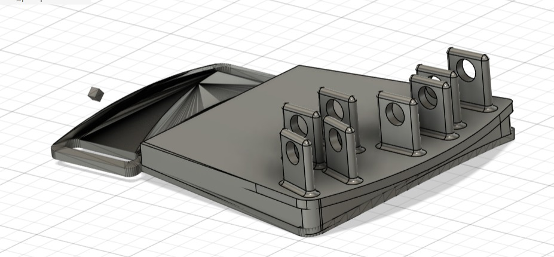
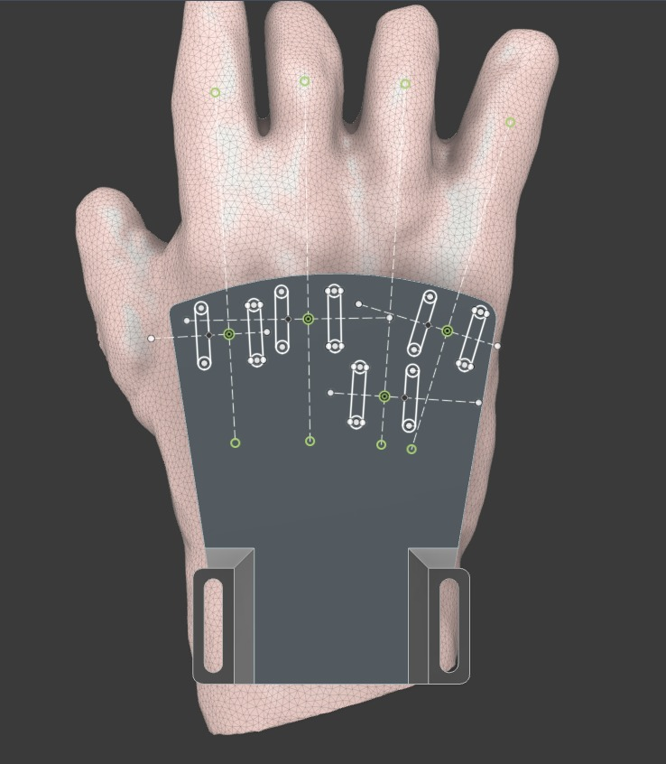
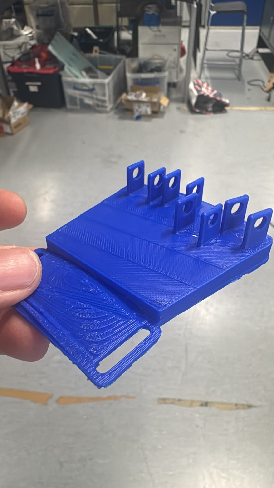
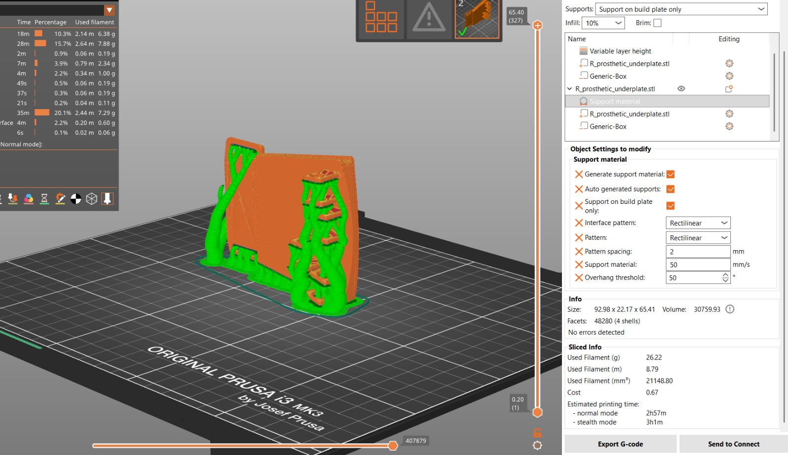

# Partial-Hand Prosthesis — Summer 2026

A co-design project to build a custom, body-powered prosthetic hand attachment for a specific client (Bassie), who has a limb difference affecting both hands. The device restores a functional grasp using 3D-printed parts and a cable-driven mechanism — no motors, no batteries.

---

## Goal

Design, prototype, and iterate on a body-powered prosthetic hand that:
- Restores functional grasp (closing fingers around an object and holding it) for a client with a partial-hand limb difference
- Is driven entirely by the user's own residual motion — thumb movement tensions a cable that closes the fingers; elastic bands return them
- Is 3D-printed so the team can go from a CAD change to a physical part in a few hours
- Is custom-fitted to the client's anatomy via a moulded thermoplastic baseplate
- Can be iterated rapidly in a university workshop setting

Two hands are being developed in parallel but with separate design tracks. The **right hand** (more tractable) is developed first; solutions are then adapted to the **left hand**, which has less residual motion and different anatomy.

---

## Mechanism

The adopted design combines two approaches:

| Approach | Source | Role |
|---|---|---|
| Cable + thumb-driven closing | Harshad | Active closing: thumb motion pulls a 0.55 mm cable routed through two capstans on the back of the hand, flexing all fingers simultaneously |
| Elastic band passive return | Fern (adapted from WILMER) | Passive opening: rubber bands return the fingers to their resting position when cable tension releases |

This gives a stronger and more controllable grasp than either approach alone. The mechanism is **underactuated** — one thumb input closes multiple joints across multiple fingers, and fingers naturally conform to the shape of whatever they grip.

---

## Components

| Component | Description |
|---|---|
| Thermoplastic baseplate | Rhinoplasty strips moulded directly to the back of the client's hand, then hardened — everything rivets or bonds to this |
| Capstans (×2) | Cable routing drums riveted to the baseplate; one thumb pull couples flexion across multiple fingers |
| Össur-style linkage digits | 5-part rigid linkage finger (Fern's design); 5 mm holes for metal dowel pin joints |
| Rolling contact joints (RCJ) | Alternative joint type — curved surfaces roll rather than pivot, no hardware needed; scaled to 50%, mirrored, with flanges |
| Knuckle hinge joints | 5 per hand × 2 hands; anchor the finger mechanisms to the baseplate at each knuckle |
| 0.55 mm cable | Runs from thumb through capstans to fingers |
| Elastic bands | Passive extension return |
| Magnetic wrist strap | Attachment to the hand — magnetic ends allow one-handed fastening |

**Left hand** uses a different strategy: one larger two-joint finger mechanism sized to the client's middle appendage, driven from the **wrist** rather than the thumb (wrist extension flexes the PIP joints; elastic band returns the distal joints).

---

## Project Summary

| Phase | Status |
|---|---|
| Research & concept selection | ✅ Complete (15 Jun) |
| Combined mechanism agreed | ✅ Complete (15 Jun) |
| Digit CAD (Össur-style linkage, right hand) | ✅ Complete (18 Jun) |
| Drive CAD (capstans, cable system) | ✅ Complete (18 Jun) |
| Rolling contact joint variants | ✅ Complete (18–19 Jun) |
| Attachment design (hinges, Velcro tabs, strap) | ✅ Complete (19 Jun) |
| Left-hand concept (wrist-driven) | ✅ Defined (19 Jun) |
| 3D printing & assembly | ✅ Began 22 Jun |
| First demo to Bassie | Target: 24 Jun |
| Iterative design cycle | Ongoing |

---

## Tech Stack

| Tool | Purpose |
|---|---|
| CAD software (STEP output) | Parametric design of all components — digits, hinges, capstans, chassis |
| Bambu Studio | Slicing STL files for the Bambu Lab X1 printer |
| Bambu Lab X1 | Primary FDM printer (PLA structural parts) |
| Ultimaker / Biolab printers | Secondary print facilities |
| Harshad's personal printer | Overnight backup printing |
| 3D scanner | Capturing client's hand geometry for custom fit |
| Thermoplastic moulding | Rhinoplasty strips shaped to the back of the hand for the baseplate |
| GitHub | Version control for CAD files, documentation, and research notes |

**Print settings:** 0.08 mm layer height, 15% infill, PLA. TPU considered for grip caps (deferred — conflicts with capacitive touch screen use).

---

## The Team

| Person | Area |
|---|---|
| Harshad | Cable-driven mechanism; owns 3D printing (personal printer backup); capstan and RCJ CAD models |
| Fern | Lead CAD for Össur-style linkage digit; WILMER elastic approach; left-hand wrist mechanism concept |
| Etienne | Rolling contact joint CAD adaptation |
| Eito | RCJ sizing for client's thumb; hollowed-out finger variant |
| Weasley | 3D modelling; design-for-manufacture; Hackspace liaison |
| Alex | Plan of Work and Hackspace access; safety/induction; fitted RCJ cap modelling |
| Anya | CAD support; 3D print/scan of left hand anatomy |
| Mervyn | Left-hand string-pulley concept; attachment methods; materials and biocompatibility research |
| Nikhil, Anais | Attended planning meeting (15 Jun) |

---

## Repository Structure

```
.
├── cad/
│   ├── step-files/        # STEP files for all designed components
│   └── 3d-models/         # STL / print-ready files
├── scans/                 # 3D scan data of client's hand
├── photos/
│   ├── arm/               # Fit photos on client's arm
│   └── misc/              # Build progress, prints, assembly
├── docs/                  # Meeting notes, design decisions, handover docs
└── research/              # Papers, competitor analysis, reference models
```

---

## CAD Versions

| Component | Version | File |
|---|---|---|
| Outer phalange | V3 | `cad/step-files/V3 Outer phalange.STEP` |
| Hinge | V2 | `cad/step-files/V2 Hinge.STEP` |

---

## Progress Photos

**Chassis CAD model**


**Chassis design fitted on hand model**


**Physical 3D print — blue chassis**


**Bambu Studio — underplate slicer setup**


---

## References

- [A Body-Powered Underactuated Prosthetic Finger Driven by MCP Joint Motion (2025)](https://doi.org/10.1109/LRA.2025.3525000) — basis for Harshad's cable-driven mechanism (see Figure 2)
- [The WILMER Passive Hand Prosthesis for Toddlers (2009)](https://doi.org/10.3109/09638280903317823) — basis for Fern's elastic-band return approach
- [Knick prosthetic finger v3.55 — Printables](https://www.printables.com/model/653551-knick-prosthetic-finger-v-355) — reference model for the left-hand single-finger mechanism
- [MagSnap magnetic strap system](https://wrapitstorage.com/pages/magsnap) — reference for magnetic wrist attachment
- Össur MCPinky-style partial-hand linkage — *reference needed*
- PIPDriver mechanism — *reference needed*
