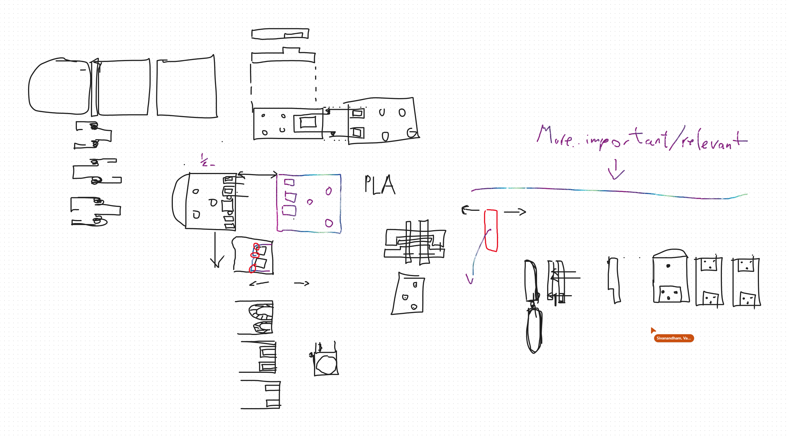
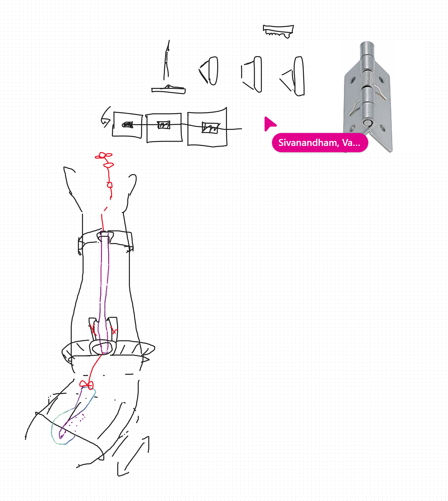
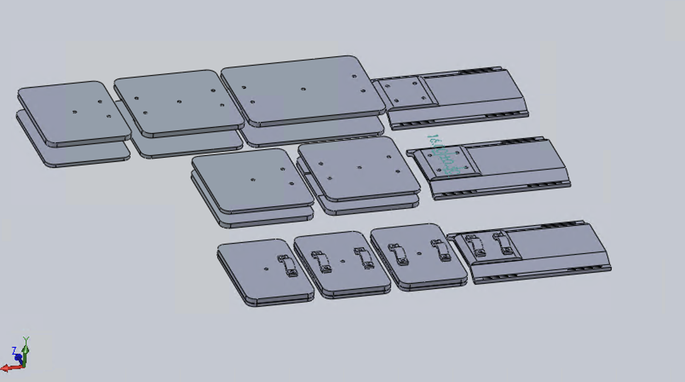
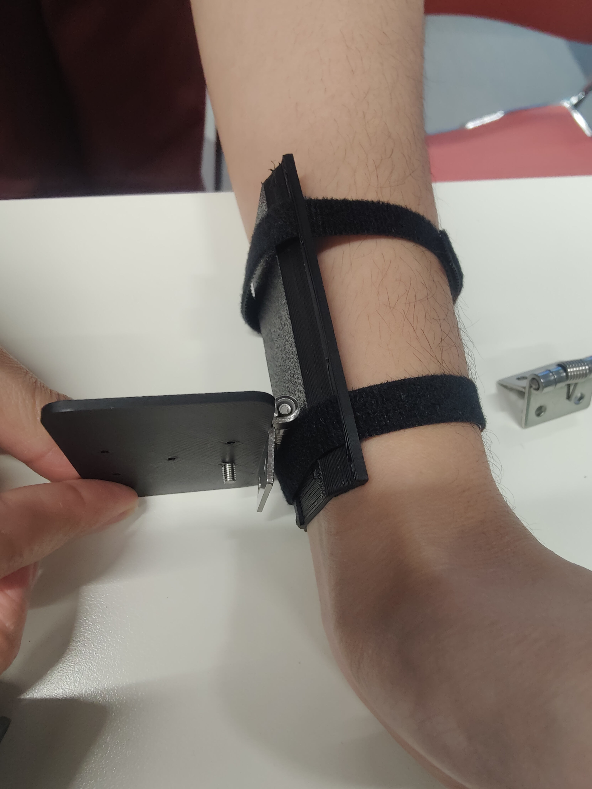
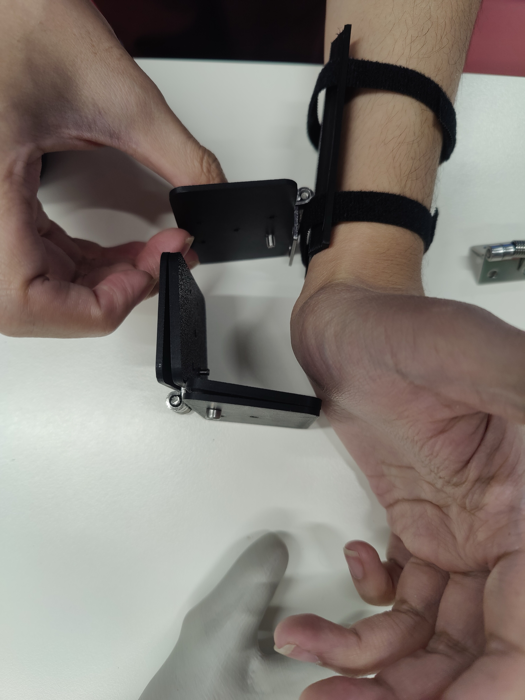
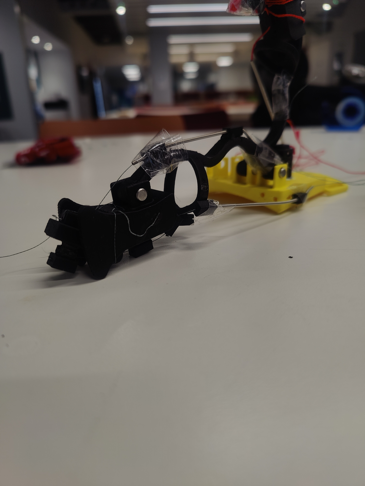
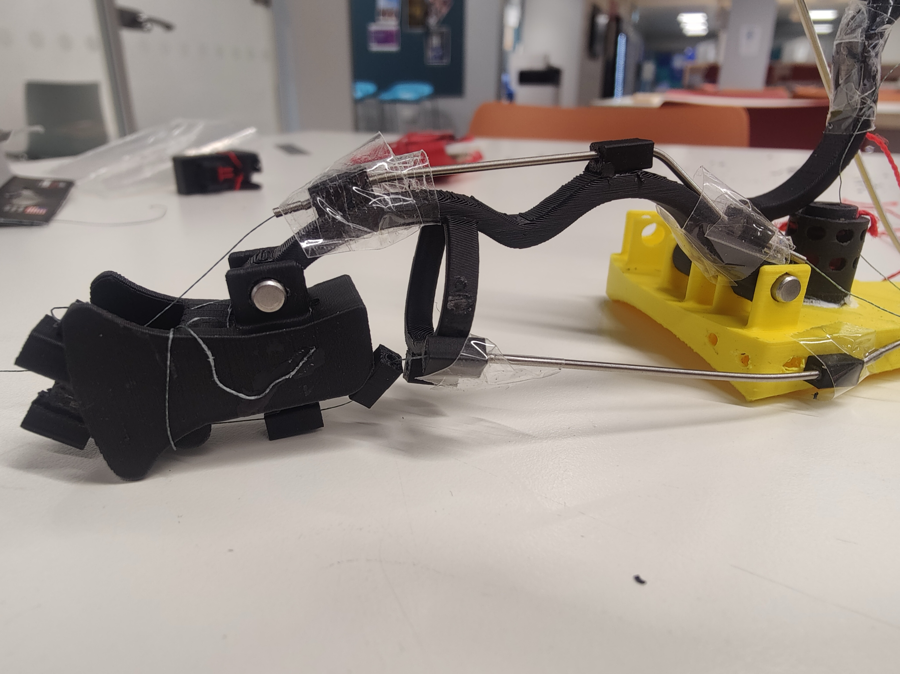

# Partial-Hand Prosthesis — Summer 2026

A co-design project to build a custom, body-powered prosthetic hand attachment for a specific client (Bassie), who has a limb difference affecting both hands. The device restores a functional grasp using 3D-printed parts and a cable-driven claw mechanism — no motors, no batteries.

---

## Goal

Design, prototype, and iterate on a body-powered prosthetic hand that:
- Restores functional grasp (closing fingers around an object and holding it) for a client with a partial-hand limb difference
- Is driven entirely by the user's own residual motion — wrist/thumb movement tensions a cable that closes the fingers; spring hinges return them
- Is 3D-printed so the team can go from a CAD change to a physical part in a few hours
- Is custom-fitted using 3D scans of both hands
- Can be iterated rapidly in a university workshop setting

Two hands are being developed with separate design tracks. The **right hand** (more tractable) was developed first; the **left hand** (less residual motion, different anatomy with a middle appendage) is developed in parallel from Stage 2 onwards.

---

## Project Stages

### Stage 1 — Design & Pre-manufacturing (12–26 June 2026)

Two competing mechanisms were proposed and combined into one right-hand design:

| Approach | Owner | Role |
|---|---|---|
| Cable + thumb-driven closing | Harshad | Active closing: residual motion pulls a cable through two capstans, flexing all fingers |
| Elastic band passive return | Fern (adapted from WILMER) | Passive opening: elastic bands return fingers to rest when tension releases |

Key components:
- **Thermoplastic baseplate** — rhinoplasty strips (4.5 × 5.8 cm, layered) moulded directly to the back of the client's hand
- **Össur-style linkage digits** — 5-part rigid linkage finger, 5 mm metal dowel pin joints (Fern's design)
- **Rolling contact joints (RCJ)** — alternative joint, scaled 50%, flanges both sides (Etienne/Eito)
- **Two capstans** riveted to the baseplate; one input couples all fingers
- **0.55 mm cable**, elastic band return, magnetic wrist strap

**Print settings:** PLA, 0.08 mm layer height, 15% infill (~2 hours per digit + cable system)

**First demo to Bassie:** 26 June 2026

---

### Stage 2 — Claw Mechanism (6 July 2026 onwards)

Following the client meeting, the design direction evolved to a **plate-based claw mechanism** — rigid finger segments on a spring-hinged wrist plate, designed by Varun in SolidWorks.

**Mechanism:** Wrist extension tensions the cable → fingers close. Spring hinges return fingers on release.

**V1 — Original plate width:**
- Equal 3-segment hand, wrist plate (upper + lower), path bracket + hook mount

**V2 — Narrow plate (current active design):**
- Equal 3-segment hand, non-equal 3-segment hand, 2-segment hand
- Narrow wrist plate, two spring hinge variants (th-61-1 and th-61sus-1)
- Path bracket + hook mount

**Left hand:** One larger two-joint finger mechanism sized to the client's middle appendage; wrist-driven.

**Team lead swapover:** 3 August 2026

---

## The Team

| Person | Area |
|---|---|
| Harshad | Cable-driven mechanism; 3D printing (personal printer backup); capstan and RCJ CAD |
| Fern | Össur-style linkage digit CAD; WILMER elastic approach; left-hand wrist mechanism |
| Etienne | Rolling contact joint CAD |
| Eito | RCJ sizing for client's thumb; hollowed-out finger variant |
| Weasley | 3D modelling; design-for-manufacture; Hackspace liaison |
| Alex | Plan of Work and Hackspace access; safety/induction; RCJ cap modelling |
| Anya | CAD support; 3D scan/print of client's hands |
| Mervyn | Left-hand string-pulley concept; attachment methods; biocompatibility research |
| Varun | Claw mechanism CAD (SolidWorks) — finger segments, wrist plate, spring hinges |
| Prithvi | FDM printing guide |
| Nikhil, Anais, Waad | Design support, test prints |

---

## Tech Stack

| Tool | Purpose |
|---|---|
| SolidWorks | Primary CAD — claw mechanism finger segments, wrist plate, spring hinges (Varun) |
| CAD / STEP | Earlier digit, hinge, capstan design |
| OpenSCAD | Parametric source for Knick finger v3.55 reference model |
| Bambu Studio | Slicing for Bambu Lab X1 |
| Bambu Lab X1 | Primary FDM printer (PLA/TPU) |
| Ultimaker / Biolab printers | Secondary print facilities |
| Harshad's personal printer | Overnight backup |
| 3D scanner + Blender | Capturing client hand geometry; postprocessed to STL |
| GitHub | Version control for all CAD, scans, photos, docs |

**Print settings:** PLA, 0.08 mm layer height, 15% infill.

---

## Repository Structure

```
.
├── cad/
│   ├── step-files/                    # V2 Hinge + V3 Outer phalange STEP files
│   ├── 3d-models/
│   │   └── knick-finger-v355/         # Knick finger v3.55 STLs + OpenSCAD source
│   ├── scans/
│   │   ├── models-v2/                 # Processed hand models (.blend, .stl, .3mf) — Apr 2026
│   │   └── old/                       # Earlier STEP + GLB scans
│   ├── varun-claw-mechanism/          # Full SolidWorks claw mechanism — V1 + V2
│   └── misc/                          # LH middle finger linkage SLDPRT
├── photos/
│   ├── arm/
│   │   ├── right-arm/                 # Right arm reference photos
│   │   ├── left-arm/                  # Left arm reference photos
│   │   └── both/                      # Both hands
│   ├── client-meeting-26-jun/
│   │   ├── general/                   # General meeting photos
│   │   └── fitting/                   # Fitting session photos + short videos
│   └── misc/
│       ├── claw-design-sketches/      # Varun + Alex concept sketches (Jul 2026)
│       └── (assembly + slicer progress photos)
├── docs/
│   ├── meeting-minutes/
│   │   ├── stage-1/                   # 15, 18, 19 June minutes
│   │   └── stage-2/                   # Client meeting 26 Jun + 6 Jul – 24 Jul minutes
│   ├── design/                        # Design notes, cable clamp, spring hinge, manufacturing ideas
│   ├── research/                      # Prosthetic hand research notes
│   └── guides/                        # FDM printing crash course (Prithvi)
├── research/
│   └── papers/                        # Academic PDFs + Knick finger reference + measurement guide
└── tracking/
    ├── Budget Tracker & Wishlist.xlsx
    └── Test Cases.docx
```

---

## 3D Printing Files

### Knick Prosthetic Finger v3.55

Reference left-hand finger model (Printables). Default-size STLs in `cad/3d-models/knick-finger-v355/` — ready to slice and print. The OpenSCAD source files allow scaling to the client's measurements.

| File | Part |
|---|---|
| `finger_base_v35.stl` | Base / mounting plate |
| `finger_socket_v35.stl` | Socket connecting base to first segment |
| `finger_middle_v35.stl` | Middle phalanx |
| `finger_tip_v35.stl` | Distal tip |
| `finger_tipcover_v35.stl` | Tip cover |
| `finger_linkage_v35.stl` | Drive linkage |
| `finger_bumper_v35.stl` | End-stop bumper |
| `finger_plugs_v351.stl` | Hinge plugs |
| `finger_v355.scad` | Parametric source — edit to scale to client measurements |

See `research/papers/Finger_Prosthetic_Measurement_Guide_rev_0_4.pdf` for how to measure and scale.

### Varun — Claw Mechanism (SolidWorks .SLDPRT / .SLDASM)

```
cad/varun-claw-mechanism/
├── V1-Equal-3-Segment-Hand/      # 3 equal segments, original plate width
├── V1-Wrist-Plate/               # Upper + lower wrist plate
├── V1-Brackets/                  # Path bracket + hook mount
├── V2-Equal-3-Segment-Hand/      ← current main design
├── V2-Non-Equal-3-Segment-Hand/  # Varying segment lengths
├── V2-2-Segment-Hand/            # 2-segment variant
├── V2-Wrist-Plate/               # Narrow wrist plate
├── V2-Brackets/                  # Path bracket + hook mount
├── V2-Spring-Hinge/              # th-61-1 spring hinge assembly
└── V2-Spring-Hinge-2/            # th-61sus-1 spring hinge variant
```

### Client Hand Scans (for fit reference)

```
cad/scans/
├── models-v2/    # LeftHand v2.blend, RightHand v2.blend, postprocessed STLs, bothHands_print.3mf
└── old/          # Left Hand.STEP, Right Hand.STEP, Left/Right Hand.glb
```

### Legacy STEP Files

| Component | Version |
|---|---|
| Outer phalange | V3 — `cad/step-files/V3 Outer phalange.STEP` |
| Hinge | V2 — `cad/step-files/V2 Hinge.STEP` |

---

## Progress Photos

### Design concept sketches — July 2026

**9 Jul — Segment and spring constrainment design (Varun + Alex)**


**10 Jul — Arm attachment concept (Varun + Alex)**


### Claw mechanism — first assembly (20 July 2026)

**V2 CAD parts laid out**


**Wrist plate fitted on arm with Velcro straps and spring hinge**


**Spring hinge flexing — range of motion**


**Full assembly — left hand (black) and right hand (yellow) with cable routing**



**Left hand — cable and segment detail**


### Early chassis work (June 2026)

**Chassis CAD model**


**Chassis on hand model**


**Blue chassis — first physical print**


**Bambu Studio — underplate slicer setup**


---

## References

- [Knick prosthetic finger v3.55 — Printables](https://www.printables.com/model/653551-knick-prosthetic-finger-v-355) — reference model for left-hand mechanism; STLs in `cad/3d-models/knick-finger-v355/`
- [A Body-Powered Underactuated Prosthetic Finger Driven by MCP Joint Motion (2025)](https://doi.org/10.1109/LRA.2025.3525000) — basis for cable-driven mechanism
- [The WILMER Passive Hand Prosthesis for Toddlers (2009)](https://doi.org/10.3109/09638280903317823) — basis for elastic-band return approach
- [MagSnap magnetic strap system](https://wrapitstorage.com/pages/magsnap) — reference for magnetic wrist attachment
- Academic papers in `research/papers/`: Human Hand Anatomy Based Prosthetic; Passive Prosthetic Hands
- FDM printing guide: `docs/guides/FDM Printing Crash Course.docx` (Prithvi)
- Measurement guide: `research/papers/Finger_Prosthetic_Measurement_Guide_rev_0_4.pdf`
